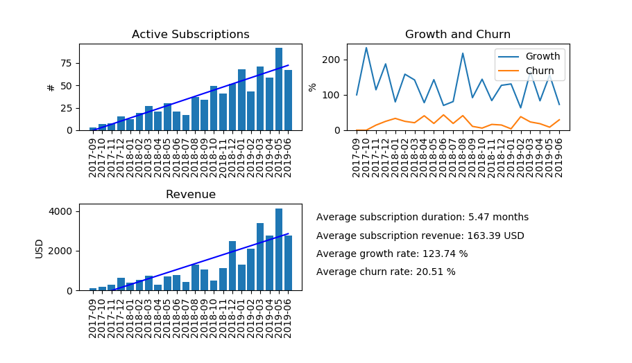

# PaPaNalyze
PayPal sales/subscription data analysis and visualization.

A set of scripts to analyze and visualize financial data from PayPal.

PayPal does not offer very good analytics for subscriptions (such as churn rate, customer lifetime, or automatic currency conversion).
These scripts provide some insights into your PayPal subscriptions.

Here is an example of data extracted from PayPal monthly sales report (MSR) files.

**Contents:**
- ```msr_parser.py``` A parser of PayPal monthly sales report (MSR) files to extract subscription data.
- ```subscriptions_analyzer.py``` A script to analyze and visualize data parsed from ```msr_parser.py```.
- ```example.py``` Simple example of how to use the above scripts.


## [msr_parser.py](msr_parser.py)
A file parser for PayPal Monthly Sales Reports (MSR) files (CSV format).
It matches monthly payments into continuous subscriptions, 
It automatically converts currencies by using exchangeratesapi.io
(using the dayly exchange rate reported on the day of the transaction),
and calculates month-over-month growth and churn.

## [subscriptions_analyzer.py](subscriptions_analyzer.py)
Data analysis of PayPal subscription data extracted from PayPal monthly sales reports (MSRs).
Produces a graph with the most important information about the ongoing PayPal subscriptions.


## [example.py](example.py)
A simple example how to use the other two scripts.
